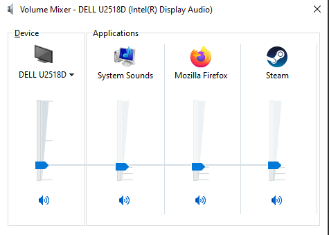

# Streamdeck-volumemixer

Streamdeck-volumemixer is a streamdeck plugin that allows you to control the Windows volume mixer through your streamdeck.

[For more information about the Windows volume mixer, see this article.](https://www.howtogeek.com/244963/how-to-adjust-the-volume-for-individual-apps-in-windows/)

## Requirements

- Windows 10
- .NET runtime, but this should already be included in your windows 10 installation
- Streamdeck software v5.x 

## Usage
- Install the plugin
- Add the volume increase/decrease buttons
- Pick the application that they should control. You can only choose applications that are visible in the Windows volume mixer.
- Keep the key pressed to raise or lower the volume, depending on the action you chose.

## Known issues

There seems to be some timing issue, causing the applications list to be empty sometimes. Restarting the stream deck software or re-creating the key might help.

## Credit

This project uses [the Streamdeck-tools library created by BarRaider](https://github.com/BarRaider/streamdeck-tools).